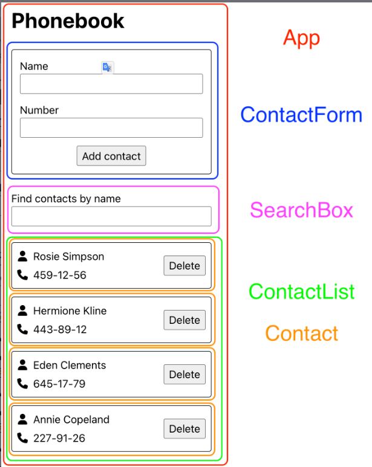
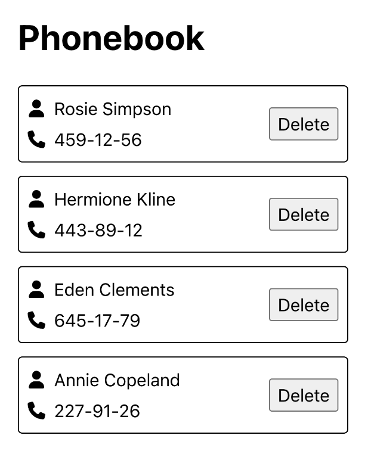

# Домашнє завдання `goit-react-hw-03`

## Книга контактів
Напиши застосунок для зберігання контактів телефонної книги. Застосунок повинен складатися з форми, списку контактів та поля пошуку для фільтрації списку контактів. Подивіться демо-відео роботи застосунку.

<iframe width="778" height="438" src="https://www.youtube.com/embed/ZZCYEl2Yc7U" title="Книга контактів" frameborder="0" allow="accelerometer; autoplay; clipboard-write; encrypted-media; gyroscope; picture-in-picture; web-share" referrerpolicy="strict-origin-when-cross-origin" allowfullscreen></iframe>


## Компоненти
У цьому завданні інтерфейс вже розділений на компоненти. Твоя задача - обдумати стан і пропси та перенести це в код. Частини інтерфейсу, які входять в компонент, відзначені рамкою відповідного кольору.

Треба виділити наступні компоненти:
- кореневий компонент
- форма додавання контактів
- список контактів
- елемент списку контактів
- фільтр пошуку

Як бачиш, всі компоненти рендеряться всередині компонента **App**. Його розмітка виглядатиме так, плюс пропси та інший код.

```html
<div>
  <h1>Phonebook</h1>
  <ContactForm />
  <SearchBox />
  <ContactList />
</div>
```

> ![NOTE] На цей раз ми будемо давати тобі менше підказок, ніж у минулому домашньому завданні. Це зроблено спеціально, щоб ти поступово звик до розробки компонентів, їх пропсів і логіки додатка.
>

Крок 1 -

У стані компонента **App** повинен бути масив контактів. На етапі розробки буде зручно жорстко закодувати деякі дані в стані. Це уникне необхідності ручного введення даних у інтерфейсі для тестування нового функціоналу. Наприклад, використай цей масив контактів для початкового значення стану.


```js
[
  {id: 'id-1', name: 'Rosie Simpson', number: '459-12-56'},
  {id: 'id-2', name: 'Hermione Kline', number: '443-89-12'},
  {id: 'id-3', name: 'Eden Clements', number: '645-17-79'},
  {id: 'id-4', name: 'Annie Copeland', number: '227-91-26'},
]
```

Створіть компоненти **ContactList** та **Contact** та використовуйте їх для відображення списку контактів. Передайте необхідні значення через пропси.

Після цього кроку інтерфейс застосунку буде виглядати наступним чином - заголовок сторінки та список контактів.

Крок 2 - **Пошук за ім'ям**
Додайте поле пошуку **SearchBox**, яке можна використовувати для фільтрації списку контактів за ім'ям.
- Поле пошуку – це інпут без форми, значення якого записується у стан (контрольований елемент).
- Логіка фільтрації повинна бути нечутливою до регістру.

> ![NOTE] Стан фільтру слід зберігати в компоненті **App** і передавати потрібні значення як пропси компоненту **SearchBox**. Тоді фільтрація масиву контактів буде виконуватися в компоненті **App**, а її результат - масив відфільтрованих контактів - передавати пропсом компоненту **ContactList**.

Після цього кроку при вводі тексту в поле пошуку, список контактів повинен оновлюватися, щоб відобразити лише підходящі контакти.

<iframe width="778" height="438" src="https://www.youtube.com/embed/DtzimoNHUzQ" title="Крок 2 - Пошук за ім&#39;ям" frameborder="0" allow="accelerometer; autoplay; clipboard-write; encrypted-media; gyroscope; picture-in-picture; web-share" referrerpolicy="strict-origin-when-cross-origin" allowfullscreen></iframe>

Крок 3 - **Додавання контактів**

На цьому етапі реалізуй додавання контакту до списку контактів через форму **ContactForm**. Кожен контакт повинен бути об'єктом з властивостями **name**, **number** та **id**, тобто таким самим, як в тестових даних, які зараз знаходяться у тебе в стані.

> ![NOTE] Для генерації ідентифікаторів використовуй будь-який відповідний пакет, наприклад [nanoid](https://www.npmjs.com/package/nanoid). У майбутньому цим буде займатися база даних, а поки що додаємо ідентифікатор об'єкта самостійно, наприклад, під час сабміту форми.

Форму обов'язково створи за допомогою бібліотеки [Formik](https://formik.org/). Додай валідацію полів форми бібліотекою [Yup](https://github.com/jquense/yup) та виведи повідомлення про помилки:

- поля повинні бути обов'язковими для заповнення
- мінімальна кількість символів - 3
- максимальна кількість символів - 50

Після завершення цього кроку застосунок повинен виглядати приблизно так.
<iframe width="778" height="438" src="https://www.youtube.com/embed/GDIcmgB0QaE" title="Крок 3 - Додавання контактів" frameborder="0" allow="accelerometer; autoplay; clipboard-write; encrypted-media; gyroscope; picture-in-picture; web-share" referrerpolicy="strict-origin-when-cross-origin" allowfullscreen></iframe>

Крок 4 - **Видалення контактів**

Розшир функціонал застосунку, дозволяючи користувачу видаляти раніше збережені контакти кліком по кнопці **Delete** в карточці контакта.

<iframe width="778" height="438" src="https://www.youtube.com/embed/oFmrtzhgoqk" title="Крок 4 - Видалення контактів" frameborder="0" allow="accelerometer; autoplay; clipboard-write; encrypted-media; gyroscope; picture-in-picture; web-share" referrerpolicy="strict-origin-when-cross-origin" allowfullscreen></iframe>

Крок 5 - **Збереження контактів**

Застосунок повинен зберігати масив контактів між оновленням сторінки в локальному сховищі. Використовуй ефекти.

- Під час додавання та видалення контакту контакти зберігаються у локальне сховище.
- Під час завантаження застосунку контакти, якщо такі є, зчитуються з локального сховища і записуються у стан.
<iframe width="778" height="438" src="https://www.youtube.com/embed/TgAc8ZtufZ8" title="Крок 5 - Збереження контактів" frameborder="0" allow="accelerometer; autoplay; clipboard-write; encrypted-media; gyroscope; picture-in-picture; web-share" referrerpolicy="strict-origin-when-cross-origin" allowfullscreen></iframe>
